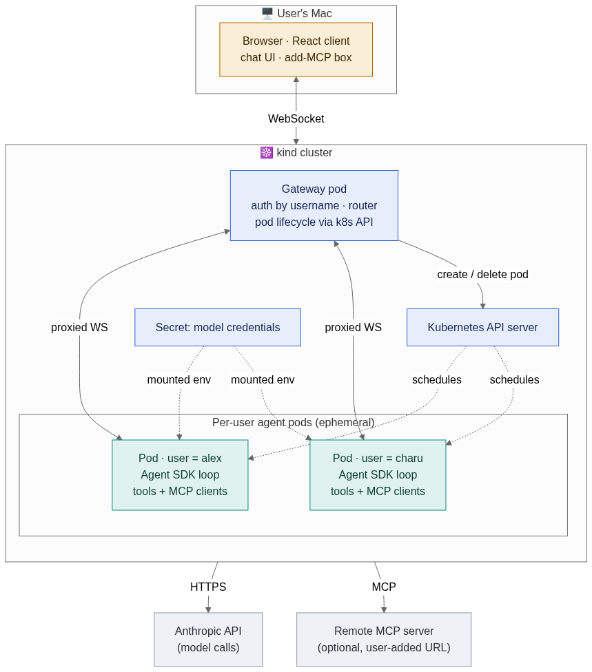
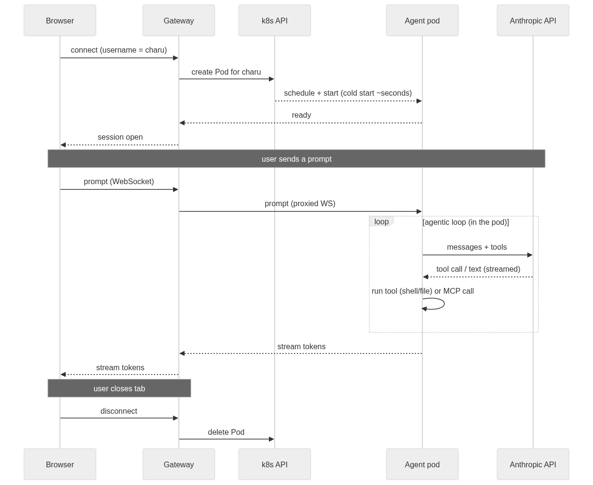
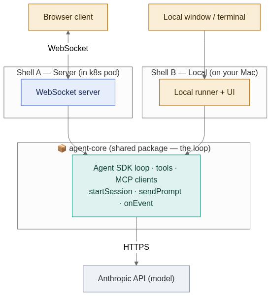
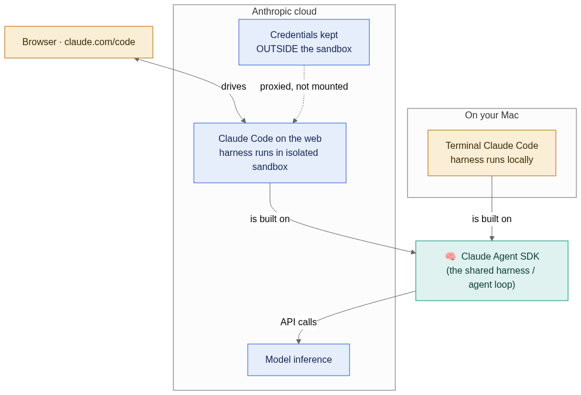
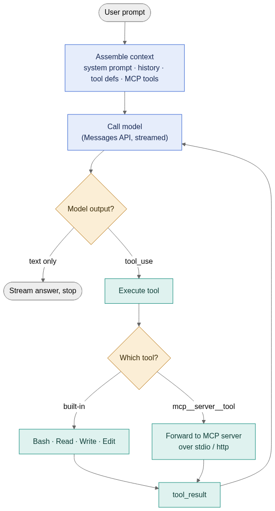

# Claude Code in the browser, one pod per user

A three-tier design that moves the *display* to a browser and the *execution* into an isolated
Kubernetes pod — so the agentic loop, the tools, and the MCP servers all run server-side, per user,
on a local `kind` cluster.

> This document is the architecture rationale behind the build. For the exact requirements and what
> shipped, see [the design spec](superpowers/specs/2026-07-18-claude-in-browser-k8s-design.md) and the
> [implementation plan](superpowers/plans/2026-07-18-claude-in-browser-k8s.md). For how to run it
> yourself, see the [README](../README.md).

**Decisions locked in:**

| | |
|---|---|
| Runtime | **Claude Agent SDK (TypeScript)** in the pod |
| Lifecycle | **Ephemeral pods** — spawn on connect, delete on disconnect |
| Identity | **Typed username** (no auth) |
| MCP | **Add-a-server box + live status panel** (a mini `/mcp`) |
| Transport | **WebSocket** |
| Pod creation | **Gateway calls the k8s API** |
| Packaging | **One shared `agent-core`, two shells** (pod for browser + local Mac app) |
| Credentials | **Claude subscription long-lived token** (`claude setup-token`) → k8s Secret → `CLAUDE_CODE_OAUTH_TOKEN` in the pod |

Auth uses your existing Claude subscription — no `ANTHROPIC_API_KEY` needed. This was verified as the
riskiest unknown before anything else was built: a clean Linux container running the CLI headless with
only the subscription token, no Keychain, no API key.

---

## 1. What runs where

Three tiers. The browser is a **dumb terminal**; the gateway is a **router + pod spawner**; each user's
pod is where **everything real happens**.

| Tier | Where | Responsibility |
|---|---|---|
| **Client (React)** | User's Mac · browser | Chat UI, message stream, "Add MCP" box + status panel, one WebSocket to the gateway. No API key, no tools, no loop. |
| **Gateway / control plane** | 1 shared pod · k8s | Maps username → pod, creates/deletes pods via the k8s API, proxies the WebSocket to the pod, holds a scoped ServiceAccount. |
| **Agent pod** | 1 pod per user · k8s | Runs the Agent SDK loop, holds the model credentials, runs tools (shell, files), connects to MCP servers. |



*Fig. 1 — Topology. Two browser tabs with two names = two pods you can watch appear.*

---

## 2. Why this shape

The split isn't arbitrary — each boundary exists because something *can only live on one side of it*.
Read each section as "what forces this?"

### Why a browser for the UI (not a terminal, not a native app)

- **Reach without install.** The whole premise is "Claude Code available from a URL." A browser is the
  one client every user already has — no `brew install`, no per-OS build. That's the entire reason to
  move off the terminal.
- **The UI has no reason to be privileged.** Rendering chat and streaming tokens needs zero access to a
  filesystem, shell, or API key. So the client can safely be the least-trusted, most-disposable tier — a
  thin view.
- **It forces a clean network seam.** Because a browser *can't* run tools, you're pushed into a
  client/server split with one well-defined channel (the WebSocket). That seam is exactly what lets the
  backend scale independently.

### Why the loop runs in a pod (server-side), never in the browser

- **Secrets.** The loop calls the Anthropic API, so it holds a credential. In a browser that key ships to
  every user and leaks instantly. It must sit somewhere the user can't read — a server process.
- **Capability.** "Claude Code" *is* running commands and editing files. A browser tab has no shell and
  no filesystem; a pod does. The agent has to run where those exist.
- **MCP.** stdio MCP servers are local subprocesses. Only a real OS process (the pod) can spawn and talk
  to them.
- **Statefulness.** An agentic session is long-lived, stateful, and messy (working directory, open MCP
  connections, conversation memory). That belongs in a durable server process, not a tab that can close
  mid-loop.

### Why one pod per user (not one shared backend)

- **Isolation is the product.** Each user gets a shell and filesystem. If two users shared a process,
  user A's `rm -rf` or runaway MCP hits user B. A pod is a hard blast-radius boundary — separate
  filesystem, separate process tree, separate memory.
- **Resource fairness.** One user's runaway loop can be capped with pod CPU/memory limits without
  touching anyone else.
- **Clean lifecycle.** "Session over" becomes "delete the pod" — all state and stray processes vanish at
  once. No cleanup logic to get wrong. This is exactly why ephemeral pods are trivially correct.
- **It's the mechanic this project set out to demonstrate.** Per-user pods are the literal answer to "how
  does this scale" — the unit of scaling *is* the user.

### Why Kubernetes at all (not just Docker, not a VM)

- **On-demand scheduling is a solved problem.** "Create an isolated environment on demand, place it on a
  machine with room, tear it down after" is precisely what the k8s API + scheduler do. Rebuilding that by
  hand over raw Docker is the hard part you'd otherwise write.
- **One API, many machines.** On `kind` it's one node; the *same* `create Pod` call spreads across a real
  cluster later. The code doesn't change as you scale.
- **Batteries you'll want.** Secrets, resource limits, namespaces, RBAC, networking — already there, so
  the gateway stays small.

### Why a separate gateway tier (why not let the browser talk to pods directly)

- **Browsers can't reach pods.** Pod IPs are internal to the cluster and ephemeral. Something inside the
  cluster must be the stable, public entry point.
- **Someone must decide "which pod is yours" and create it.** That's an authority the client can't have.
  The gateway owns identity → pod mapping and holds the scoped ServiceAccount that's allowed to
  create/delete pods.
- **It keeps the k8s API private.** Only the gateway talks to the control plane; the client only ever
  sees one WebSocket. Smaller attack surface, cleaner boundary.

Concretely, when you open the app and type a name, you're talking to the gateway the whole time — never
directly to a pod. It reads your username, calls the Kubernetes API to create `agent-<yourname>`, waits
for it to come up (the ~1–2s cold start you can watch in `kubectl get pods -w`), then gets out of the way
and just relays bytes between your browser and your pod for the rest of the session
(`apps/gateway/src/proxy.ts`). When you close the tab, the gateway notices the socket died and deletes
your pod. The gateway never touches the model or your prompts' content — it's purely the **router +
pod-lifecycle authority**, the one process trusted to mint and connect you to your own isolated pod, so
nothing else needs elevated privileges or public exposure.

**The one-line version:** UI in the browser because it needs no privilege and must be installable-free ·
loop in a pod because it holds secrets, needs a shell/filesystem, and is stateful · one pod per user
because isolation is the whole product · Kubernetes because on-demand isolated environments is exactly
its job · a gateway because someone trusted must route to and mint those pods.

### The auth story — and a distinction worth being precise about

**"The gateway is trusted" and "the browser is trusted" are different claims, and this design only makes
the first one.**

- The gateway is trusted **by Kubernetes** — it holds a real credential (its ServiceAccount token, set up
  by the RBAC in `k8s/rbac.yaml`), and the k8s API believes whoever presents that token. That trust is
  earned by *possessing a secret the browser never sees*.
- The browser is trusted by the gateway for **exactly one thing: a self-reported username string**, with
  zero verification. The entire check, in `apps/gateway/src/index.ts`, is:
  ```ts
  if (hello.type !== "hello" || !hello.username) { /* reject */ }
  ```
  Any non-empty string is accepted. If you type `alex`, the gateway hands you `alex`'s pod — no password,
  no session token, nothing stopping you from typing someone else's name and reaching their pod instead
  of your own.

So: the architecture correctly keeps the *dangerous* capability — creating/deleting pods, touching the
k8s API — behind the one tier where a real credential guards it. It does **not** verify who's making the
request. That's a deliberate, stated non-goal (see the design spec's non-goals: "real authentication —
username only, no passwords/OIDC"), not an oversight — but it means "the gateway is trustworthy" and "the
system has real auth" are two different statements, and only the first is true here. A production version
of this would need the gateway to authenticate the *browser* (a login, a signed session cookie) before it
authenticates *itself* to Kubernetes — this project only built the second half.

### What adding real auth would actually change

The fix is narrow: insert a verification step *before* `hello.username` gets trusted. Nothing about pod
creation, the proxy, or `agent-core` needs to change.

1. **The browser gets a real credential first.** Before opening the WebSocket, the client authenticates
   (OAuth login, or a simple username/password backed by a user table) and receives a **signed session
   token** — not just a string it can type.
2. **`hello` carries that token, not a bare username:** `{ "type": "hello", "token": "<signed JWT>" }`.
3. **The gateway verifies the token before doing anything else**, in the same spot in
   `apps/gateway/src/index.ts` that currently just checks `!hello.username`. Verification means checking
   the token's signature against a secret/public key only the gateway holds, and reading the username out
   of the token's *verified* claims — never out of a field the client supplied directly.
4. **`podName()` is unchanged** — same DNS-safe sanitization — except its input now comes from the
   verified identity instead of user input.

**What this would and wouldn't protect, precisely:**

| | With real auth |
|---|---|
| **Which pod you land on** | ✅ Protected. Nobody can type someone else's username and reach their pod — the pod name is derived from a cryptographically verified identity, not a self-reported string. |
| **Accountability / quotas** | ✅ Protected. "User X created N pods today" becomes a real, non-forgeable statement — useful for rate limits, billing, audit logs. |
| **Messages sent after the handshake succeeds** | ❌ Still not re-verified per message. Auth here is a **connection-time gate** — once `hello` passes, every later message on that socket is trusted as "whoever authenticated `hello`." That's normal for session-based systems, not a gap specific to this design. |
| **The gateway's own k8s credential, or pod-to-pod isolation** | ❌ Unaffected either way. Those come from RBAC (`k8s/rbac.yaml`) and Kubernetes' own pod boundaries — separate concerns that already hold regardless of how users authenticate. |

The short version: real auth would fix *identity* (which pod you can reach) and *accountability* (who did
what) — it would not, by itself, add per-message authorization or change anything about pod isolation.
Those already come from elsewhere in the design.

---

## 3. The flow of one session

From typing your name to streaming tokens back — and where the time actually goes.



*Fig. 2 — Lifecycle + message flow for one ephemeral session.*

**The latency insight this design set out to measure:** the browser↔gateway↔pod hops are in-cluster and
local — microseconds to low single-digit ms on `kind`. The cost you actually feel is (1) **pod
cold-start**, paid once per session because pods are ephemeral, and (2) the **pod→Anthropic model call**,
which is identical to what the terminal Claude Code pays today. Moving the UI to a browser adds almost no
latency; the interesting number is cold-start — and that's what a future pre-warm pool would attack.

This was measured on the real, running cluster; see [§9 of the design spec](superpowers/specs/2026-07-18-claude-in-browser-k8s-design.md#9-latency-measurement-plan-the-point-of-the-exercise) for the actual numbers.

---

## 4. The mini `/mcp`

Reproducing Claude Code's `/mcp` is a few messages on the same WebSocket. The panel in the browser *is*
your `/mcp`; the pod does the real connecting.

| Claude Code `/mcp` | This system's equivalent | Where it runs |
|---|---|---|
| See `connected` / `not connected` | `mcp.list` msg → per-server status + name | Pod reports, browser renders |
| Add a server | Add-MCP box → `mcp.add` → pod re-inits with the new server | Pod (Agent SDK) |

Since pods are ephemeral, the MCP config lives in the session's memory — no config files. One known-good
stdio MCP (a filesystem server) is baked into the pod image, and remote-URL MCPs are added at runtime via
the box — covering both transports without turning the pod into a package manager.

---

## 5. One loop, two shells

The loop is packaged so it can run **both in a pod (browser-driven) and, later, as an app on your Mac** —
the same move Anthropic makes with the Claude Agent SDK: don't build two agents, build one core and wrap
it in two thin shells.

| | |
|---|---|
| **`agent-core`** (shared package) | Wraps the Claude Agent SDK: the agentic loop, tool execution, MCP client management. Exposes a clean interface (`createSession`, `sendPrompt`, `setMcpServers`, an event stream). Knows nothing about WebSockets, HTTP, browsers, or k8s — pure engine. |
| **Shell A** — runs in the pod | Wraps `agent-core` in a WebSocket server. Bridges browser events ↔ core events. This is what `apps/pod-server` actually is. |
| **Shell B** — runs on a Mac (not yet built) | Wraps the *same* `agent-core`. Drives it from a local UI. Uses the real filesystem — no pod. Designed for, deferred to a follow-up. |



*Fig. 3 — Same core, two shells. Adding the Mac app becomes "write a second thin wrapper," not a second
agent.*

**Why this is the right factoring:** it's exactly how Anthropic ships it (SDK harness → terminal shell +
cloud-sandbox shell), it means the interesting logic is tested once, and a future browser-vs-Mac latency
comparison becomes apples-to-apples because the same code runs on both sides — the only variable is the
pod hop plus cold-start.

---

## Appendix: what Claude Code actually does

### Verified: the same harness powers both surfaces

Confirmed from Anthropic's public docs (not from any leaked source): the **Claude Agent SDK is the same
agent loop that powers Claude Code**, exposed as a library — it was renamed from "Claude Code SDK" to
"Claude Agent SDK" (~March 2026) for exactly that reason. **Terminal Claude Code** runs that harness
locally on your machine; **Claude Code on the web** runs each session in an **isolated cloud sandbox**
(filesystem + network isolation, with sensitive credentials kept *outside* the sandbox). The model always
runs on Anthropic's servers.



*Fig. 4 — Anthropic's real shape (from public docs). This project mirrors the right half; a future Mac
app would mirror the left half.*

> **Security note worth stealing later:** Anthropic keeps credentials *outside* the sandbox and proxies
> model calls, so a compromised session never sees the key. This project mounts the key as a Secret for
> simplicity — fine for a local `kind` cluster, but a "credential proxy at the gateway" is the honest
> upgrade path to production.

### What the loop itself does

Claude Code (and the Agent SDK underneath it) is fundamentally a **loop** around the model that can call
tools and MCP servers.



*Fig. 5 — The agentic loop. "MCP support" = extra tool definitions injected at the top, whose calls get
forwarded to a server instead of run locally.*

### MCP connection, concretely

On startup Claude Code reads each server from config (a `stdio` command it spawns, or an `http`/`sse` URL
it opens), runs the MCP `initialize` handshake, and discovers that server's tools. Those tools are
exposed to the model namespaced as `mcp__<server>__<tool>`. `/mcp` is just the surface that shows each
server's connection state. In this system, the Agent SDK does the connect + discovery; the pod drives it
with the messages in [§4](#4-the-mini-mcp).
