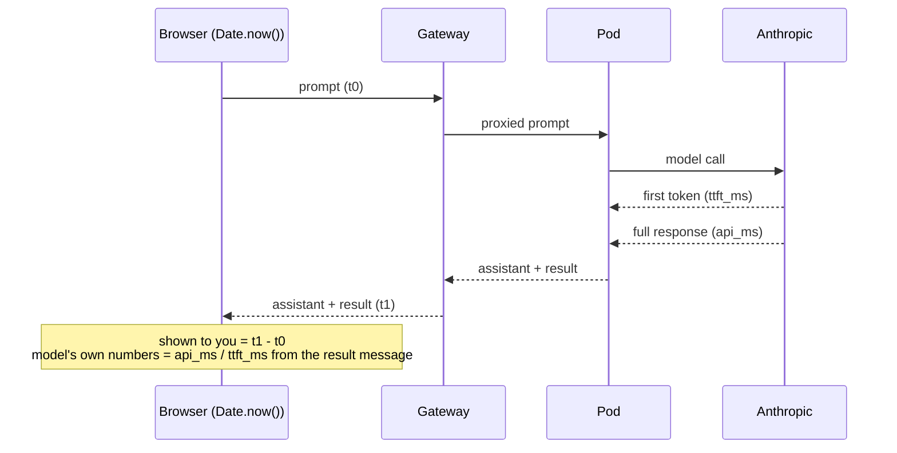

# Latency: what's measured, what isn't, and what's next

Status doc, not a design spec. This captures where the "how fast is this really" conversation stands so
it's readable without re-reading the whole thread.

## What's already measured (done, in the design spec)

[§9 of the design spec](superpowers/specs/2026-07-18-claude-in-browser-k8s-design.md#9-latency-measurement-plan-the-point-of-the-exercise)
covers three **session-level** numbers, all measured live on the real cluster:

| # | Metric | Measured | Where it's captured |
|---|---|---|---|
| 1 | Pod cold-start (create → ready) | ~1.0–2.1s | Gateway log, once per session |
| 2 | Browser↔gateway↔pod network hop | 2ms median | `ping`/`pong` round trip |
| 3 | Model call (`api` total / `ttft` first-token) | api 4.6–9.9s, ttft 2.4–2.5s | SDK-reported, sent to the browser in every `result` message |

(3) is what you've been reading in the UI as `— done (api …ms, ttft …ms)`.

## What's not measured yet

Everything above is either a one-time session cost (1, 2) or server-side-only per-message data (3).
Nothing currently answers: **"from the moment I hit Send, how long until I actually saw something?"**
That's a real, different number — it also includes the browser↔gateway↔pod hop *for that specific
message*, plus any queueing/serialization time, none of which today's `apiMs`/`ttftMs` account for.

## The two things `api` and `ttft` mean today

Already established in conversation, restated here for reference:

- **`ttft`** — time to first token. From when the prompt reaches Anthropic to when the model starts
  streaming a response.
- **`api`** — total duration of *every* model API call in that turn, summed. If the agent used a tool
  and made two model calls, `api` is both calls added together (tool execution time itself isn't
  counted). This is why `api` can be much larger than `ttft` when a response involves tool use or a
  long generation.

## Proposed next step (small, not yet built)

No new protocol messages, no server changes. Add a client-side stopwatch:

- Timestamp when you hit Send.
- Timestamp when the response for that prompt finishes rendering.
- Show that delta alongside the existing `api`/`ttft` numbers, with the difference
  (browser-observed total − server-reported total) labeled as network/queueing overhead.



Example of what a response line would look like once this is built:

```
you saw it in 3.1s  (network+queue: 0.6s · model ttft: 2.4s · model total: 4.6s)
```

Not implemented yet — this doc reflects the plan agreed on, not shipped code.
