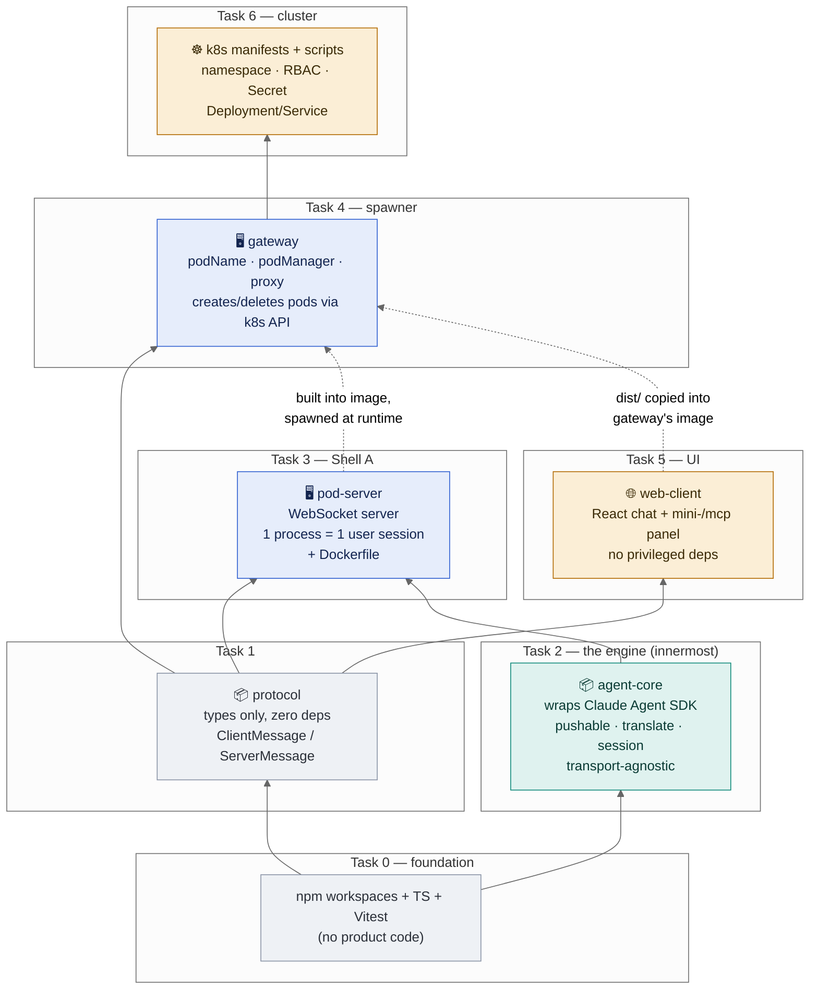

# Claude Code in the Browser on Kubernetes — Implementation Plan

> **For agentic workers:** REQUIRED SUB-SKILL: Use superpowers:subagent-driven-development (recommended) or superpowers:executing-plans to implement this plan task-by-task. Steps use checkbox (`- [ ]`) syntax for tracking.

**Goal:** Run a Claude-Code-style agent (agentic loop + tools + MCP) in a browser UI, where each user's session executes server-side in its own ephemeral Kubernetes pod on a local `kind` cluster.

**Architecture:** Three tiers plus a shared core. `agent-core` wraps the Claude Agent SDK (transport-agnostic). Shell A (`pod-server`) wraps `agent-core` in a WebSocket server and runs in a per-user pod. The `gateway` authenticates by username, creates/deletes pods via the k8s API, and proxies the browser WebSocket to the pod. The `web-client` is a thin React chat UI with a mini-`/mcp` panel.

**Tech Stack:** TypeScript (ESM), Node 24, npm workspaces, `@anthropic-ai/claude-agent-sdk` (v0.3.x), `ws`, `@kubernetes/client-node`, Vite + React, Vitest, `tsx` (run TS without a build step), Docker, `kind`, `kubectl`.

**Auth (already validated):** Claude subscription long-lived token from `claude setup-token`, provided to pods as `CLAUDE_CODE_OAUTH_TOKEN` (a k8s Secret). No API key. See spec §10 Task 1.

---

## How to read this plan

Each task opens with a **Context** block — what this piece is, *why* it exists, and how it connects to
the tiers in the architecture diagram ([docs/architecture.html](../../architecture.html)). Then come
bite-sized steps; non-obvious steps carry a `*Why:*` line so you never execute a command without
knowing what it's proving. If you only skim the Context blocks top to bottom, you should understand the
whole system before writing a line of code.

The dependency order is deliberate: we build **inside-out** — the transport-agnostic engine first
(`agent-core`), then the shell that exposes it (`pod-server`), then the thing that spawns that shell
(`gateway`), then the UI, then the cluster that runs it all. Each task produces something you can run
and verify on its own, so a failure is always localized to the task you just did.

**How this differs from the architecture doc:** [docs/architecture.html](../../architecture.html) shows
the *runtime* picture — which process talks to which over the network, once everything is deployed. The
diagram below shows the *build-time* picture instead — which package imports which, and therefore which
order we have to build them in. Same system, orthogonal view: the runtime arrows are network calls made
at 2am by a live pod; the arrows below are `import` statements resolved once, when you run `npm install`.



Read the arrows as "depends on" pointing upward: `agent-core` depends on nothing we wrote (only the SDK),
so it's built first and is the most reusable — it's also the piece that would get reused unchanged by a
future Mac-app shell. `pod-server` depends on `agent-core` + `protocol`. `gateway` doesn't import
`agent-core` at all (it never runs the loop — it only spawns pods that do), which is exactly the
separation of concerns from spec §3.3. `web-client` depends on nothing but `protocol`, keeping it
provably unprivileged. The dotted arrows aren't imports — they're the two places a *build artifact*
(a Docker image, a `dist/` folder) crosses from one task into another, which is why Task 6's scripts
build `pod-server` and `gateway` images in a specific order (`build-and-load.sh`).

---

## File Structure

```
agenticharness/
├── package.json                      # npm workspaces root
├── tsconfig.base.json                # shared TS config
├── vitest.config.ts                  # test runner config
├── kind-config.yaml                  # 1-node kind cluster
├── packages/
│   ├── protocol/                     # shared WS message TYPES (no runtime deps)
│   │   ├── package.json
│   │   └── src/index.ts
│   └── agent-core/                   # the loop (wraps Agent SDK) — transport-agnostic
│       ├── package.json
│       ├── src/
│       │   ├── index.ts              # public exports
│       │   ├── pushable.ts           # async input queue (pure, tested)
│       │   ├── translate.ts          # SDKMessage -> CoreEvent (pure, tested)
│       │   └── session.ts            # createSession(): runs query(), emits CoreEvents
│       └── test/
│           ├── pushable.test.ts
│           └── translate.test.ts
├── apps/
│   ├── pod-server/                   # Shell A — runs in the per-user pod
│   │   ├── package.json
│   │   ├── src/index.ts              # WS server on :8080, one session per process
│   │   └── Dockerfile
│   ├── gateway/                      # control plane — shared pod
│   │   ├── package.json
│   │   ├── src/
│   │   │   ├── index.ts              # http (static client) + ws (/ws) server
│   │   │   ├── podName.ts            # username -> pod name (pure, tested)
│   │   │   ├── podManager.ts         # k8s create/wait-ready/delete
│   │   │   └── proxy.ts              # pipe browser WS <-> pod WS
│   │   ├── test/podName.test.ts
│   │   └── Dockerfile
│   └── web-client/                   # React UI
│       ├── package.json
│       ├── index.html
│       ├── vite.config.ts
│       └── src/{main.tsx,App.tsx,ws.ts,McpPanel.tsx,styles.css}
├── k8s/
│   ├── namespace.yaml
│   ├── rbac.yaml                     # ServiceAccount + Role + RoleBinding (pods only)
│   ├── secret.example.yaml
│   └── gateway.yaml                  # Deployment + Service (NodePort)
└── scripts/
    ├── setup-cluster.sh              # create kind cluster + namespace + rbac
    ├── create-secret.sh              # push the token into a k8s Secret
    └── build-and-load.sh             # build both images, kind load them
```

---

## Task 0: Repo scaffolding

**Context:** Everything we build is TypeScript that runs on Node, and the project has several pieces
(`agent-core`, `pod-server`, `gateway`, `web-client`) that depend on each other. **npm workspaces** lets
those pieces live in one repo and reference each other by name (e.g. `pod-server` imports
`@claude-lab/agent-core`) without publishing to a registry — a change in the engine is instantly visible
to the shell that uses it. We also set up **Vitest** now because the plan is test-driven: for the pieces
with real logic, we write the test before the code. Nothing here is product code; it's the foundation so
every later task has a place to live and a way to be tested.

**Files:**
- Create: `package.json`, `tsconfig.base.json`, `vitest.config.ts`

- [ ] **Step 1: Root `package.json` with workspaces**

Create `package.json`:
```json
{
  "name": "claude-lab",
  "private": true,
  "type": "module",
  "workspaces": ["packages/*", "apps/*"],
  "engines": { "node": ">=24" },
  "scripts": {
    "test": "vitest run",
    "typecheck": "tsc -b --pretty"
  },
  "devDependencies": {
    "typescript": "^5.6.0",
    "tsx": "^4.19.0",
    "vitest": "^2.1.0",
    "@types/node": "^24.0.0"
  }
}
```

- [ ] **Step 2: Shared TS config**

Create `tsconfig.base.json`:
```json
{
  "compilerOptions": {
    "target": "ES2023",
    "module": "NodeNext",
    "moduleResolution": "NodeNext",
    "strict": true,
    "esModuleInterop": true,
    "skipLibCheck": true,
    "declaration": true,
    "sourceMap": true,
    "resolveJsonModule": true
  }
}
```

- [ ] **Step 3: Vitest config**

Create `vitest.config.ts`:
```ts
import { defineConfig } from "vitest/config";
export default defineConfig({
  test: { include: ["packages/**/test/**/*.test.ts", "apps/**/test/**/*.test.ts"] },
});
```

- [ ] **Step 4: Install and verify**

Run: `npm install`
Expected: installs without error; `node_modules/` created (already gitignored).

- [ ] **Step 5: Commit**
```bash
git add package.json tsconfig.base.json vitest.config.ts package-lock.json
git commit -m "chore: scaffold npm workspaces + TS + vitest"
```

---

## Task 1: `protocol` package (shared WS message types)

**Context:** Three separate programs talk over one WebSocket: the browser, the gateway, and the pod. If
each defined its own idea of "what a message looks like," they'd drift apart and break in ways the
compiler couldn't catch. So we define the message shapes **once**, in a tiny types-only package that all
three import. This is the contract for the whole system — `ClientMessage` is everything the browser can
say (join, send a prompt, add an MCP server), `ServerMessage` is everything the pod can say back (status,
assistant text, tool calls, MCP status, results with latency numbers, errors). It has zero runtime code
and zero dependencies on purpose: the browser must be able to import it without dragging in the Agent SDK
or Node libraries. Read this file and you know the entire browser↔pod conversation.

**Files:**
- Create: `packages/protocol/package.json`, `packages/protocol/src/index.ts`

- [ ] **Step 1: Package manifest**

Create `packages/protocol/package.json`:
```json
{
  "name": "@claude-lab/protocol",
  "version": "0.0.0",
  "type": "module",
  "main": "src/index.ts",
  "exports": { ".": "./src/index.ts" }
}
```

- [ ] **Step 2: Message types**

Create `packages/protocol/src/index.ts`:
```ts
// Wire types shared by web-client, gateway, and pod-server.

export type McpServerSpec =
  | { transport: "http"; url: string }
  | { transport: "sse"; url: string }
  | { transport: "stdio"; command: string; args?: string[] };

/** Browser -> gateway -> pod */
export type ClientMessage =
  | { type: "hello"; username: string }
  | { type: "prompt"; text: string }
  | { type: "mcp.add"; name: string; server: McpServerSpec }
  | { type: "mcp.list" }
  | { type: "ping"; t: number }; // for in-cluster latency measurement

/** Pod -> gateway -> browser */
export type ServerMessage =
  | { type: "session.status"; state: "starting" | "ready" | "error"; detail?: string }
  | { type: "assistant"; text: string }
  | { type: "tool_call"; name: string; input: unknown }
  | { type: "mcp.status"; servers: { name: string; status: string }[] }
  | { type: "result"; ok: boolean; durationMs?: number; apiMs?: number; ttftMs?: number; detail?: string }
  | { type: "pong"; t: number }
  | { type: "error"; message: string };
```

- [ ] **Step 3: Verify it typechecks**

Run: `npx tsc --noEmit -p tsconfig.base.json packages/protocol/src/index.ts` (or `npm run typecheck` once project refs exist)
Expected: no errors.

- [ ] **Step 4: Commit**
```bash
git add packages/protocol
git commit -m "feat(protocol): shared websocket message types"
```

---

## Task 2: `agent-core` (the loop)

**Context:** This is the heart of the whole project and the reason it exists — the *agentic loop*. It
wraps the **Claude Agent SDK**, which (as we verified) is the same harness that powers Claude Code
itself. The SDK's `query()` gives us the loop, tool execution (Bash/Read/Write), and MCP support for
free; our job is to wrap it behind a clean, transport-agnostic interface (`createSession`, `sendPrompt`,
`setMcpServers`, an event callback). "Transport-agnostic" is the key design choice from spec §5: this
package knows nothing about WebSockets, HTTP, browsers, or Kubernetes — which is exactly what lets the
*same* engine later power both the pod (Shell A) and a local Mac app (Shell B) without a rewrite. It's
the "one loop" in "one loop, two shells."

We split it into three files so each has one job and the tricky parts are unit-testable without touching
the network: `pushable.ts` (an async queue that lets us feed prompts into a long-lived `query()` over
time — the SDK's streaming-input mode needs an async iterable), `translate.ts` (a *pure function* that
converts the SDK's ~40 message types into our handful of `CoreEvent`s — pure means we can test it with
plain objects, no live model), and `session.ts` (the thin wiring that runs the loop and connects the
two). The two pure files get real TDD; the live wiring gets a smoke test that actually calls the model.

**Files:**
- Create: `packages/agent-core/package.json`, `src/pushable.ts`, `src/translate.ts`, `src/session.ts`, `src/index.ts`
- Test: `test/pushable.test.ts`, `test/translate.test.ts`

- [ ] **Step 1: Package manifest**

Create `packages/agent-core/package.json`:
```json
{
  "name": "@claude-lab/agent-core",
  "version": "0.0.0",
  "type": "module",
  "main": "src/index.ts",
  "exports": { ".": "./src/index.ts" },
  "dependencies": {
    "@anthropic-ai/claude-agent-sdk": "^0.3.212"
  }
}
```
Run: `npm install` (hoists the SDK into the workspace).

- [ ] **Step 2: Write the failing test for the pushable input queue**

*Why:* A Claude Code session is long-lived — the user sends prompt after prompt into the *same* running
loop. The SDK models this as "streaming input": `query()` accepts an async iterable that yields user
messages over time. But a chat UI doesn't have all the prompts up front; they arrive as the user types.
A "pushable" bridges that gap — an async iterable you can `push()` into later. The hard part is the
timing (a consumer that's already waiting when nothing is queued must wake up the instant you push), so
we test both orderings: items pushed *before* iteration and items pushed *while the consumer is blocked*.

Create `packages/agent-core/test/pushable.test.ts`:
```ts
import { describe, it, expect } from "vitest";
import { createPushable } from "../src/pushable.js";

describe("createPushable", () => {
  it("yields items pushed before iteration", async () => {
    const p = createPushable<number>();
    p.push(1); p.push(2); p.end();
    const got: number[] = [];
    for await (const n of p) got.push(n);
    expect(got).toEqual([1, 2]);
  });

  it("resolves items pushed after the consumer is waiting", async () => {
    const p = createPushable<string>();
    const got: string[] = [];
    const consumer = (async () => { for await (const s of p) got.push(s); })();
    await new Promise((r) => setTimeout(r, 10)); // let consumer block on empty queue
    p.push("a"); p.push("b"); p.end();
    await consumer;
    expect(got).toEqual(["a", "b"]);
  });
});
```

- [ ] **Step 3: Run the test, verify it fails**

Run: `npx vitest run packages/agent-core/test/pushable.test.ts`
Expected: FAIL — cannot find module `../src/pushable.js`.

- [ ] **Step 4: Implement the pushable queue**

Create `packages/agent-core/src/pushable.ts`:
```ts
export interface Pushable<T> extends AsyncIterable<T> {
  push(item: T): void;
  end(): void;
}

/** An async iterable you can push into over time (streaming input for query()). */
export function createPushable<T>(): Pushable<T> {
  const queue: T[] = [];
  let wake: (() => void) | null = null;
  let ended = false;

  async function* gen(): AsyncGenerator<T> {
    while (true) {
      if (queue.length > 0) {
        yield queue.shift()!;
      } else if (ended) {
        return;
      } else {
        await new Promise<void>((resolve) => { wake = resolve; });
        wake = null;
      }
    }
  }
  const iterator = gen();
  return {
    [Symbol.asyncIterator]: () => iterator,
    push(item: T) { queue.push(item); wake?.(); },
    end() { ended = true; wake?.(); },
  };
}
```

- [ ] **Step 5: Run the test, verify it passes**

Run: `npx vitest run packages/agent-core/test/pushable.test.ts`
Expected: PASS (2 tests).

- [ ] **Step 6: Write the failing test for the message translator**

*Why:* The SDK emits a firehose of ~40 message types (thinking, hooks, task notifications, retries, and
much more). The browser only cares about a few things: assistant text, tool calls, MCP status, the final
result, and errors. `translate` is the filter/adapter between those two worlds. Keeping it a **pure
function** (SDK message in → array of our events out, no side effects) is what makes it testable with
hand-written objects — we can assert the exact mapping without a network, an API key, or a running model.
It also isolates our system from SDK churn: when the SDK adds message types, only this one file changes.

Create `packages/agent-core/test/translate.test.ts`:
```ts
import { describe, it, expect } from "vitest";
import { translate, type CoreEvent } from "../src/translate.js";

describe("translate", () => {
  it("maps a system/init message to mcp_status", () => {
    const out = translate({
      type: "system", subtype: "init",
      mcp_servers: [{ name: "files", status: "connected" }],
    } as any);
    expect(out).toEqual([{ type: "mcp_status", servers: [{ name: "files", status: "connected" }] }]);
  });

  it("maps assistant text and tool_use blocks", () => {
    const out = translate({
      type: "assistant",
      message: { content: [
        { type: "text", text: "hello" },
        { type: "tool_use", name: "Bash", input: { command: "ls" } },
      ] },
    } as any);
    expect(out).toEqual([
      { type: "assistant", text: "hello" },
      { type: "tool_call", name: "Bash", input: { command: "ls" } },
    ]);
  });

  it("maps a success result with latency fields", () => {
    const out = translate({
      type: "result", subtype: "success",
      duration_ms: 1200, duration_api_ms: 900, ttft_ms: 300,
    } as any);
    expect(out).toEqual([{ type: "result", ok: true, durationMs: 1200, apiMs: 900, ttftMs: 300 }]);
  });

  it("maps an error result", () => {
    const out = translate({ type: "result", subtype: "error_max_turns" } as any);
    expect(out).toEqual([{ type: "result", ok: false, detail: "error_max_turns" }]);
  });

  it("surfaces assistant auth errors", () => {
    const out = translate({
      type: "assistant", error: "authentication_failed",
      message: { content: [] },
    } as any);
    expect(out).toEqual([{ type: "error", message: "authentication_failed" }]);
  });

  it("ignores unhandled message types", () => {
    expect(translate({ type: "stream_event" } as any)).toEqual([]);
  });
});
```

- [ ] **Step 7: Run the test, verify it fails**

Run: `npx vitest run packages/agent-core/test/translate.test.ts`
Expected: FAIL — cannot find module `../src/translate.js`.

- [ ] **Step 8: Implement the translator**

Create `packages/agent-core/src/translate.ts`. (Field shapes verified against
`@anthropic-ai/claude-agent-sdk` v0.3.212 `sdk.d.ts`: `SDKAssistantMessage.message.content[]`,
`SDKSystemMessage.mcp_servers`, `SDKResultSuccess.duration_ms/duration_api_ms/ttft_ms`.)
```ts
import type { SDKMessage } from "@anthropic-ai/claude-agent-sdk";

export type CoreEvent =
  | { type: "assistant"; text: string }
  | { type: "tool_call"; name: string; input: unknown }
  | { type: "mcp_status"; servers: { name: string; status: string }[] }
  | { type: "result"; ok: boolean; durationMs?: number; apiMs?: number; ttftMs?: number; detail?: string }
  | { type: "error"; message: string };

export function translate(msg: SDKMessage): CoreEvent[] {
  switch (msg.type) {
    case "system":
      if (msg.subtype === "init") {
        return [{ type: "mcp_status", servers: msg.mcp_servers ?? [] }];
      }
      return [];
    case "assistant": {
      const events: CoreEvent[] = [];
      if (msg.error) events.push({ type: "error", message: msg.error });
      for (const block of (msg.message?.content ?? []) as any[]) {
        if (block.type === "text") events.push({ type: "assistant", text: block.text });
        else if (block.type === "tool_use") events.push({ type: "tool_call", name: block.name, input: block.input });
      }
      return events;
    }
    case "result":
      if (msg.subtype === "success") {
        return [{ type: "result", ok: true, durationMs: msg.duration_ms, apiMs: msg.duration_api_ms, ttftMs: msg.ttft_ms }];
      }
      return [{ type: "result", ok: false, detail: msg.subtype }];
    default:
      return [];
  }
}
```

- [ ] **Step 9: Run the test, verify it passes**

Run: `npx vitest run packages/agent-core/test/translate.test.ts`
Expected: PASS (6 tests).

- [ ] **Step 10: Implement the session runner**

*Why:* This is where the pushable and the translator come together into a live loop. Three choices worth
understanding: (1) We pass the pushable as `prompt`, which puts `query()` in streaming-input mode — the
only mode where control methods like `setMcpServers()` work, which we need for the "add an MCP" feature.
(2) We drain the query in a **background async loop** (the self-invoking `async () => {…}`) because the
loop runs for the whole session; we can't `await` it inline or `sendPrompt` would block forever. Events
flow out through the `onEvent` callback instead. (3) We set `permissionMode: "bypassPermissions"` because
**the pod itself is the sandbox** — there's no human at a terminal to approve each tool call, and the
isolation that would normally make that dangerous is provided by the pod boundary (spec §7). `cwd` is
`/workspace`, the scratch dir we create in the pod image.

Create `packages/agent-core/src/session.ts`. Constructs `SDKUserMessage` objects for streaming input —
verify the minimal required fields against `SDKUserMessage` in `sdk.d.ts` if the SDK rejects them.
```ts
import { query, type Query, type SDKUserMessage, type McpServerConfig } from "@anthropic-ai/claude-agent-sdk";
import { createPushable, type Pushable } from "./pushable.js";
import { translate, type CoreEvent } from "./translate.js";

export interface SessionOptions {
  cwd?: string;
  mcpServers?: Record<string, McpServerConfig>;
}

export interface Session {
  sendPrompt(text: string): void;
  setMcpServers(servers: Record<string, McpServerConfig>): Promise<void>;
  dispose(): Promise<void>;
}

function userMessage(text: string): SDKUserMessage {
  // Minimal streaming-input user message.
  return {
    type: "user",
    message: { role: "user", content: text },
    parent_tool_use_id: null,
    session_id: "",
  } as unknown as SDKUserMessage;
}

export function createSession(
  onEvent: (e: CoreEvent) => void,
  opts: SessionOptions = {},
): Session {
  const input: Pushable<SDKUserMessage> = createPushable<SDKUserMessage>();

  const q: Query = query({
    prompt: input,
    options: {
      cwd: opts.cwd ?? "/workspace",
      permissionMode: "bypassPermissions", // the pod IS the sandbox
      mcpServers: opts.mcpServers ?? {},
    },
  });

  // Drain the query in the background, forwarding translated events.
  (async () => {
    try {
      for await (const msg of q) {
        for (const e of translate(msg)) onEvent(e);
      }
    } catch (err) {
      onEvent({ type: "error", message: err instanceof Error ? err.message : String(err) });
    }
  })();

  return {
    sendPrompt(text: string) { input.push(userMessage(text)); },
    async setMcpServers(servers) { await q.setMcpServers(servers); },
    async dispose() { input.end(); await q.interrupt().catch(() => {}); },
  };
}
```

- [ ] **Step 11: Public exports**

Create `packages/agent-core/src/index.ts`:
```ts
export { createSession } from "./session.js";
export type { Session, SessionOptions } from "./session.js";
export type { CoreEvent } from "./translate.js";
```

- [ ] **Step 12: Smoke-test the live session (gated on the token)**

Create `packages/agent-core/smoke.ts` (a runnable script, not a vitest test — it hits the model):
```ts
import { createSession } from "./src/index.js";
const s = createSession((e) => console.log(JSON.stringify(e)), { cwd: process.cwd() });
s.sendPrompt("Reply with exactly: SESSION_OK");
setTimeout(() => s.dispose(), 30000);
```
Run (uses your host subscription login):
```bash
cd packages/agent-core && npx tsx smoke.ts
```
Expected: an `{"type":"assistant","text":"SESSION_OK"}` line and a `{"type":"result","ok":true,...}` line. If you see `{"type":"error","message":"authentication_failed"}`, the token/login is the problem, not the code.

- [ ] **Step 13: Commit**
```bash
git add packages/agent-core
git commit -m "feat(agent-core): SDK-backed session with pushable input and event translation"
```

---

## Task 3: `pod-server` (Shell A)

**Context:** `agent-core` is a library — it can't be reached over the network by itself. Shell A is the
thin server that *exposes* it: it opens a WebSocket, and for that connection it creates exactly one
`agent-core` session. This is where the "one pod = one user" model becomes concrete — the whole process
serves a single person's session, so there's no multi-tenant routing, no locking, no cross-user state to
get wrong. Its only real work is translation: JSON `ClientMessage`s coming in become `agent-core` calls
(`sendPrompt`, `setMcpServers`), and `CoreEvent`s coming out become JSON `ServerMessage`s. It also bakes
in one default MCP server (the filesystem MCP pointed at `/workspace`) so MCP works the moment the pod
starts, and it handles `ping`/`pong` so we can later measure the in-cluster network hop. This is the code
that will run *inside the per-user pod* — the green "Agent pod" box in the diagram.

**Files:**
- Create: `apps/pod-server/package.json`, `apps/pod-server/src/index.ts`, `apps/pod-server/Dockerfile`

- [ ] **Step 1: Package manifest**

Create `apps/pod-server/package.json`:
```json
{
  "name": "@claude-lab/pod-server",
  "version": "0.0.0",
  "type": "module",
  "scripts": { "start": "tsx src/index.ts" },
  "dependencies": {
    "@claude-lab/agent-core": "*",
    "@claude-lab/protocol": "*",
    "@modelcontextprotocol/server-filesystem": "^2025.0.0",
    "ws": "^8.18.0"
  },
  "devDependencies": { "@types/ws": "^8.5.0" }
}
```
Run: `npm install`. (If the exact `@modelcontextprotocol/server-filesystem` version tag differs,
run `npm view @modelcontextprotocol/server-filesystem version` and use that; it is the baked-in
default stdio MCP.)

- [ ] **Step 2: Implement the WS server**

Create `apps/pod-server/src/index.ts`:
```ts
import { WebSocketServer, WebSocket } from "ws";
import { createSession, type Session, type CoreEvent } from "@claude-lab/agent-core";
import type { ClientMessage, ServerMessage, McpServerSpec } from "@claude-lab/protocol";
import type { McpServerConfig } from "@anthropic-ai/claude-agent-sdk";

const PORT = Number(process.env.PORT ?? 8080);

// Default baked-in MCP server so MCP works out of the box.
const defaultMcp: Record<string, McpServerConfig> = {
  files: { type: "stdio", command: "npx", args: ["-y", "@modelcontextprotocol/server-filesystem", "/workspace"] } as McpServerConfig,
};

function specToConfig(s: McpServerSpec): McpServerConfig {
  if (s.transport === "http") return { type: "http", url: s.url } as McpServerConfig;
  if (s.transport === "sse") return { type: "sse", url: s.url } as McpServerConfig;
  return { type: "stdio", command: s.command, args: s.args ?? [] } as McpServerConfig;
}

function coreToServer(e: CoreEvent): ServerMessage {
  switch (e.type) {
    case "mcp_status": return { type: "mcp.status", servers: e.servers };
    case "assistant": return { type: "assistant", text: e.text };
    case "tool_call": return { type: "tool_call", name: e.name, input: e.input };
    case "result": return { type: "result", ok: e.ok, durationMs: e.durationMs, apiMs: e.apiMs, ttftMs: e.ttftMs, detail: e.detail };
    case "error": return { type: "error", message: e.message };
  }
}

const wss = new WebSocketServer({ port: PORT, host: "0.0.0.0" });
console.log(`pod-server listening on :${PORT}`);

wss.on("connection", (ws: WebSocket) => {
  const send = (m: ServerMessage) => ws.readyState === ws.OPEN && ws.send(JSON.stringify(m));
  const mcpServers: Record<string, McpServerConfig> = { ...defaultMcp };
  const session: Session = createSession((e) => send(coreToServer(e)), { cwd: "/workspace", mcpServers });
  send({ type: "session.status", state: "ready" });

  ws.on("message", async (raw) => {
    let msg: ClientMessage;
    try { msg = JSON.parse(raw.toString()); } catch { return; }
    if (msg.type === "prompt") session.sendPrompt(msg.text);
    else if (msg.type === "ping") send({ type: "pong", t: msg.t });
    else if (msg.type === "mcp.add") {
      mcpServers[msg.name] = specToConfig(msg.server);
      try { await session.setMcpServers(mcpServers); }
      catch (e) { send({ type: "error", message: `mcp.add failed: ${e instanceof Error ? e.message : e}` }); }
    }
    // mcp.list: status is pushed as mcp.status on init and after setMcpServers.
  });

  ws.on("close", () => { session.dispose().catch(() => {}); });
});
```

- [ ] **Step 3: Local run to verify it starts**

Run: `cd apps/pod-server && PORT=8080 npm start`
Expected: prints `pod-server listening on :8080`. Stop with Ctrl-C.

- [ ] **Step 4: Dockerfile**

*Why:* This is the image every per-user pod runs. The build context is the **repo root** (not the app
dir) because the app imports sibling workspace packages (`agent-core`, `protocol`) — Docker needs to see
them to install and resolve. We install `ca-certificates` so the container can make HTTPS calls to the
Anthropic API. We `mkdir /workspace` because that's the `cwd` the agent works in and where the filesystem
MCP is rooted. Notice there's **no token in the image** — it's injected at runtime as an env var from the
k8s Secret (spec §7), so the same image is safe to share and rebuild.

Create `apps/pod-server/Dockerfile` (build context is the repo root):
```dockerfile
FROM node:24-slim
RUN apt-get update && apt-get install -y --no-install-recommends ca-certificates && rm -rf /var/lib/apt/lists/*
WORKDIR /app
COPY package.json package-lock.json ./
COPY packages ./packages
COPY apps/pod-server ./apps/pod-server
RUN npm ci
RUN mkdir -p /workspace
ENV PORT=8080
EXPOSE 8080
CMD ["npm", "--workspace", "@claude-lab/pod-server", "start"]
```

- [ ] **Step 5: Build the image**

Run (from repo root): `docker build -f apps/pod-server/Dockerfile -t claude-lab/pod-server:dev .`
Expected: image builds; `docker images | grep pod-server` shows it.

- [ ] **Step 6: Container smoke test (auth + one prompt over WS)**

Run:
```bash
docker run --rm -d --name podtest -p 8080:8080 \
  -e CLAUDE_CODE_OAUTH_TOKEN="$(cat .secrets/oauth-token)" claude-lab/pod-server:dev
sleep 3
node -e '
const WebSocket = require("ws");
const ws = new WebSocket("ws://localhost:8080");
ws.on("open", () => ws.send(JSON.stringify({type:"prompt",text:"Reply with exactly: POD_OK"})));
ws.on("message", (m) => { const e=JSON.parse(m); console.log(e); if(e.type==="result") process.exit(0); });
setTimeout(()=>process.exit(1), 40000);
'
docker rm -f podtest
```
Expected: an `{ type: "assistant", text: "POD_OK" }` message then a `result` with `ok:true`. (Install `ws` at repo root first if the one-liner can't resolve it: it's a dep of pod-server so it's hoisted.)

- [ ] **Step 7: Commit**
```bash
git add apps/pod-server
git commit -m "feat(pod-server): websocket shell around agent-core + Dockerfile"
```

---

## Task 4: `gateway` (control plane)

**Context:** This is the tier that makes "one pod per user, on demand" actually happen — the orchestration
mechanic you set out to understand. A browser can't reach a pod directly (pod IPs are internal and
ephemeral) and can't be trusted to create pods, so a trusted in-cluster component must sit in the middle.
The gateway does four things, each mapping to a design decision: (1) **identity** — reads the typed
username and derives a deterministic pod name, so the same user always maps to the same pod; (2)
**lifecycle** — calls the Kubernetes API to create the pod and waits until it's Running with an IP (this
is the pod cold-start you'll measure), and deletes it on disconnect (ephemeral, spec §3.1); (3) **proxy**
— once the pod is up, it pipes the browser's WebSocket straight through to the pod's WebSocket, so from
then on the gateway is just a pass-through; (4) **serving the UI** — it also hands the browser the static
React files. It runs with a **least-privilege ServiceAccount** that can only touch pods in one namespace
(spec §7) — so even if the gateway were compromised, the blast radius is bounded. We split out `podName`
(pure, unit-tested — it must produce DNS-safe names or the k8s API rejects them) from `podManager` (the
live k8s calls) and `proxy` (the pipe) so each is small and independently understandable.

**Files:**
- Create: `apps/gateway/package.json`, `src/podName.ts`, `src/podManager.ts`, `src/proxy.ts`, `src/index.ts`, `Dockerfile`
- Test: `test/podName.test.ts`

- [ ] **Step 1: Package manifest**

Create `apps/gateway/package.json`:
```json
{
  "name": "@claude-lab/gateway",
  "version": "0.0.0",
  "type": "module",
  "scripts": { "start": "tsx src/index.ts" },
  "dependencies": {
    "@claude-lab/protocol": "*",
    "@kubernetes/client-node": "^0.22.0",
    "ws": "^8.18.0"
  },
  "devDependencies": { "@types/ws": "^8.5.0" }
}
```
Run: `npm install`.

- [ ] **Step 2: Write the failing test for podName**

*Why:* Kubernetes object names must be DNS-1123 labels: lowercase, alphanumeric-plus-hyphen, ≤63 chars,
no leading/trailing hyphen. A username like `"Charu Anchlia!"` would be rejected by the k8s API and the
pod would never get created. This function is the sanitizer, and it must be **deterministic** (same
username → same name) because that's how a reconnect finds the user's existing pod instead of orphaning
it. It's pure string logic, so it's the perfect thing to lock down with tests before anything touches a
cluster — a bug here would otherwise surface as a confusing k8s API error much later.

Create `apps/gateway/test/podName.test.ts`:
```ts
import { describe, it, expect } from "vitest";
import { podName } from "../src/podName.js";

describe("podName", () => {
  it("prefixes and lowercases", () => {
    expect(podName("Charu")).toBe("agent-charu");
  });
  it("replaces invalid chars with hyphens", () => {
    expect(podName("a b_c!")).toBe("agent-a-b-c");
  });
  it("is deterministic (same user -> same pod)", () => {
    expect(podName("alex")).toBe(podName("alex"));
  });
  it("trims to a DNS-safe length and strips trailing hyphens", () => {
    const n = podName("x".repeat(80));
    expect(n.length).toBeLessThanOrEqual(63);
    expect(n.endsWith("-")).toBe(false);
  });
});
```

- [ ] **Step 3: Run the test, verify it fails**

Run: `npx vitest run apps/gateway/test/podName.test.ts`
Expected: FAIL — cannot find module `../src/podName.js`.

- [ ] **Step 4: Implement podName**

Create `apps/gateway/src/podName.ts`:
```ts
/** Map a username to a deterministic, DNS-1123-safe pod name. */
export function podName(username: string): string {
  const slug = username.toLowerCase().replace(/[^a-z0-9]+/g, "-").replace(/^-+|-+$/g, "");
  return `agent-${slug}`.slice(0, 63).replace(/-+$/g, "");
}
```

- [ ] **Step 5: Run the test, verify it passes**

Run: `npx vitest run apps/gateway/test/podName.test.ts`
Expected: PASS (4 tests).

- [ ] **Step 6: Implement the pod manager**

*Why:* This file is the actual "spawn a container per user" magic, expressed as k8s API calls.
`loadFromCluster()` reads the ServiceAccount token that k8s mounts into the gateway pod — that's how the
gateway authenticates to the API without any hard-coded credentials. `ensurePod` is written to be
**idempotent** (it swallows the `AlreadyExists`/409 error) so a reconnecting user reuses their pod rather
than crashing. It then **polls** until the pod is `Running` with an IP, because pod creation is async —
the API returns immediately but the container takes seconds to schedule and start (this poll *is* the
cold-start you'll measure). We inject the token via `secretKeyRef` (never in the image) and set CPU/memory
**limits** so one user's runaway loop can't starve the node (spec §7). `imagePullPolicy: IfNotPresent`
matters specifically for `kind`: our image is side-loaded with `kind load`, not pushed to a registry, so
we must tell k8s *not* to try pulling it from the internet. `sweepStalePods` is a safety net: if the
gateway restarted while pods were live, those pods are now orphaned, so we delete them on startup.

Create `apps/gateway/src/podManager.ts`:
```ts
import * as k8s from "@kubernetes/client-node";

const NAMESPACE = process.env.NAMESPACE ?? "claude-lab";
const POD_IMAGE = process.env.POD_IMAGE ?? "claude-lab/pod-server:dev";
const SECRET_NAME = process.env.TOKEN_SECRET ?? "claude-token";

const kc = new k8s.KubeConfig();
kc.loadFromCluster(); // in-cluster ServiceAccount
const core = kc.makeApiClient(k8s.CoreV1Api);

export interface PodHandle { name: string; ip: string; }

function podManifest(name: string): k8s.V1Pod {
  return {
    metadata: { name, namespace: NAMESPACE, labels: { app: "claude-agent" } },
    spec: {
      restartPolicy: "Never",
      containers: [{
        name: "agent",
        image: POD_IMAGE,
        imagePullPolicy: "IfNotPresent", // image is kind-loaded, not in a registry
        ports: [{ containerPort: 8080 }],
        env: [{
          name: "CLAUDE_CODE_OAUTH_TOKEN",
          valueFrom: { secretKeyRef: { name: SECRET_NAME, key: "token" } },
        }],
        resources: { requests: { cpu: "250m", memory: "512Mi" }, limits: { cpu: "1", memory: "1Gi" } },
      }],
    },
  };
}

/** Create the pod (idempotent) and wait until it has an IP and is Running. */
export async function ensurePod(name: string, timeoutMs = 60000): Promise<PodHandle> {
  try {
    await core.createNamespacedPod({ namespace: NAMESPACE, body: podManifest(name) });
  } catch (e: any) {
    if (e?.body?.reason !== "AlreadyExists" && e?.statusCode !== 409) throw e;
  }
  const start = Date.now();
  while (Date.now() - start < timeoutMs) {
    const res = await core.readNamespacedPod({ name, namespace: NAMESPACE });
    const phase = res.status?.phase;
    const ip = res.status?.podIP;
    if (phase === "Running" && ip) return { name, ip };
    if (phase === "Failed") throw new Error(`pod ${name} failed to start`);
    await new Promise((r) => setTimeout(r, 500));
  }
  throw new Error(`pod ${name} not ready within ${timeoutMs}ms`);
}

export async function deletePod(name: string): Promise<void> {
  try { await core.deleteNamespacedPod({ name, namespace: NAMESPACE }); } catch { /* already gone */ }
}

/** Startup safety net: delete stale agent pods. */
export async function sweepStalePods(): Promise<void> {
  const list = await core.listNamespacedPod({ namespace: NAMESPACE, labelSelector: "app=claude-agent" });
  await Promise.all((list.items ?? []).map((p) => deletePod(p.metadata!.name!)));
}
```
Note: `@kubernetes/client-node` v0.22 uses single-object-argument methods (`createNamespacedPod({namespace, body})`). If the installed version uses positional args, adjust these four calls accordingly — check `node_modules/@kubernetes/client-node` types after install.

- [ ] **Step 7: Implement the WS proxy**

*Why:* Once the pod is up, the gateway's job is nearly done — it becomes a dumb pipe. This function opens
a second WebSocket *to the pod* and forwards raw bytes in both directions, so prompts flow browser→pod and
streamed events flow pod→browser with the gateway adding essentially zero latency (the point from spec §9:
the in-cluster hop is negligible). It forwards messages verbatim (`d.toString()`) rather than
parsing/re-serializing — no reason to deserialize what we're just relaying, and it keeps the gateway
agnostic to protocol changes. Crucially, `browser.on("close")` closes the pod socket **and** calls
`onClose`, which is where the gateway deletes the pod — this is what makes the pod truly ephemeral.

Create `apps/gateway/src/proxy.ts`:
```ts
import { WebSocket } from "ws";
import type { ServerMessage } from "@claude-lab/protocol";

/** Pipe messages both ways between an already-open browser socket and the pod socket. */
export function proxy(browser: WebSocket, podUrl: string, onClose: () => void): void {
  const pod = new WebSocket(podUrl);
  const toBrowser = (m: ServerMessage) => browser.readyState === browser.OPEN && browser.send(JSON.stringify(m));

  pod.on("open", () => toBrowser({ type: "session.status", state: "ready" }));
  pod.on("message", (d) => browser.readyState === browser.OPEN && browser.send(d.toString()));
  pod.on("error", (e) => toBrowser({ type: "error", message: `pod socket error: ${e.message}` }));
  pod.on("close", () => browser.close());

  browser.on("message", (d) => pod.readyState === pod.OPEN && pod.send(d.toString()));
  browser.on("close", () => { pod.close(); onClose(); });
}
```

- [ ] **Step 8: Implement the gateway entrypoint**

*Why:* This ties the three helpers together into the request flow from spec §5. The HTTP server serves the
built React app (with an SPA fallback to `index.html` so client routing works). The WebSocket server
listens on `/ws`; the first message *must* be `hello{username}` — that's our (deliberately minimal)
"auth". On hello it derives the pod name, tells the browser we're `starting` (so the UI can show
"spinning up your environment" during cold-start), creates+waits for the pod, logs the cold-start time
(latency measurement), and hands off to `proxy`. Every failure path (`ensurePod` throws, bad hello) sends
a clear `session.status: error` and cleans up the pod — no silent hangs, no orphans. `sweepStalePods` runs
once at boot as the orphan safety net described above.

Create `apps/gateway/src/index.ts`:
```ts
import http from "node:http";
import fs from "node:fs";
import path from "node:path";
import { WebSocketServer } from "ws";
import type { ClientMessage, ServerMessage } from "@claude-lab/protocol";
import { podName } from "./podName.js";
import { ensurePod, deletePod, sweepStalePods } from "./podManager.js";
import { proxy } from "./proxy.js";

const PORT = Number(process.env.PORT ?? 3000);
const CLIENT_DIR = process.env.CLIENT_DIR ?? "/app/web-client/dist";

// --- static file server for the built React client ---
const types: Record<string, string> = { ".html": "text/html", ".js": "text/javascript", ".css": "text/css" };
const server = http.createServer((req, res) => {
  const urlPath = (req.url ?? "/") === "/" ? "/index.html" : req.url!;
  const file = path.join(CLIENT_DIR, urlPath.split("?")[0]);
  fs.readFile(file, (err, buf) => {
    if (err) { fs.readFile(path.join(CLIENT_DIR, "index.html"), (e2, idx) => { res.writeHead(e2 ? 404 : 200); res.end(e2 ? "not found" : idx); }); return; }
    res.writeHead(200, { "content-type": types[path.extname(file)] ?? "application/octet-stream" });
    res.end(buf);
  });
});

// --- websocket: /ws ---
const wss = new WebSocketServer({ server, path: "/ws" });
wss.on("connection", (browser) => {
  const send = (m: ServerMessage) => browser.readyState === browser.OPEN && browser.send(JSON.stringify(m));
  let podNameStr: string | null = null;

  browser.once("message", async (raw) => {
    let hello: ClientMessage;
    try { hello = JSON.parse(raw.toString()); } catch { browser.close(); return; }
    if (hello.type !== "hello" || !hello.username) { send({ type: "error", message: "expected hello{username}" }); browser.close(); return; }

    podNameStr = podName(hello.username);
    send({ type: "session.status", state: "starting", detail: `spinning up ${podNameStr}` });
    try {
      const t0 = Date.now();
      const pod = await ensurePod(podNameStr);
      console.log(`cold-start ${podNameStr}: ${Date.now() - t0}ms`);
      proxy(browser, `ws://${pod.ip}:8080`, () => { if (podNameStr) deletePod(podNameStr); });
    } catch (e) {
      send({ type: "session.status", state: "error", detail: e instanceof Error ? e.message : String(e) });
      if (podNameStr) await deletePod(podNameStr);
      browser.close();
    }
  });
});

sweepStalePods().catch((e) => console.error("sweep failed:", e));
server.listen(PORT, () => console.log(`gateway listening on :${PORT}`));
```

- [ ] **Step 9: Dockerfile**

*Why:* The gateway image bundles both the server code *and* the built React client, because the gateway
serves the UI itself (one thing to deploy, no separate web server). That's why it copies `web-client/dist`
— the pre-built static files from Task 5. The build order in `build-and-load.sh` matters for this reason:
`vite build` must run *before* `docker build` so `dist/` exists to copy.

Create `apps/gateway/Dockerfile` (context = repo root; expects `web-client/dist` to be built by Task 5 and copied in):
```dockerfile
FROM node:24-slim
WORKDIR /app
COPY package.json package-lock.json ./
COPY packages ./packages
COPY apps/gateway ./apps/gateway
RUN npm ci
# built client is copied in by build-and-load.sh after `vite build`
COPY apps/web-client/dist ./web-client/dist
ENV PORT=3000 CLIENT_DIR=/app/web-client/dist
EXPOSE 3000
CMD ["npm", "--workspace", "@claude-lab/gateway", "start"]
```

- [ ] **Step 10: Commit**
```bash
git add apps/gateway
git commit -m "feat(gateway): pod lifecycle + ws proxy + static client server"
```

---

## Task 5: `web-client` (React UI)

**Context:** This is the "dumb terminal" tier from the diagram — deliberately the least-privileged, least
-clever part. It has no API key, runs no tools, holds no loop; it captures text, opens one WebSocket, and
renders whatever streams back. That's the whole point of the architecture: moving the *display* to the
browser while the *execution* stays in the pod. The mini-`/mcp` panel is the concrete version of your "UI
that lets users add MCPs" — it lists servers with their connection status (fed by the pod's `mcp.status`
messages, exactly mirroring what `/mcp` shows in the terminal) and has a form to add a remote one. We use
Vite because it gives us a fast dev server that can proxy `/ws` to the gateway during development, and a
`build` that emits static files the gateway serves in production. Keeping this tier thin is what makes the
latency story honest — the browser adds one round-trip and nothing else.

**Files:**
- Create: `apps/web-client/package.json`, `vite.config.ts`, `index.html`, `src/main.tsx`, `src/App.tsx`, `src/ws.ts`, `src/McpPanel.tsx`, `src/styles.css`

- [ ] **Step 1: Package manifest + Vite config**

Create `apps/web-client/package.json`:
```json
{
  "name": "@claude-lab/web-client",
  "version": "0.0.0",
  "type": "module",
  "scripts": { "dev": "vite", "build": "vite build" },
  "dependencies": { "react": "^18.3.0", "react-dom": "^18.3.0", "@claude-lab/protocol": "*" },
  "devDependencies": { "@vitejs/plugin-react": "^4.3.0", "vite": "^5.4.0", "@types/react": "^18.3.0", "@types/react-dom": "^18.3.0" }
}
```
Create `apps/web-client/vite.config.ts`:
```ts
import { defineConfig } from "vite";
import react from "@vitejs/plugin-react";
export default defineConfig({
  plugins: [react()],
  server: { proxy: { "/ws": { target: "ws://localhost:3000", ws: true } } },
});
```
Run: `npm install`.

- [ ] **Step 2: HTML entry**

Create `apps/web-client/index.html`:
```html
<!doctype html>
<html><head><meta charset="utf-8"><title>Claude Lab</title><link rel="stylesheet" href="/src/styles.css"></head>
<body><div id="root"></div><script type="module" src="/src/main.tsx"></script></body></html>
```

- [ ] **Step 3: WebSocket hook helper**

Create `apps/web-client/src/ws.ts`:
```ts
import type { ClientMessage, ServerMessage } from "@claude-lab/protocol";

export function connect(username: string, onMsg: (m: ServerMessage) => void): {
  send: (m: ClientMessage) => void; close: () => void;
} {
  const url = `${location.protocol === "https:" ? "wss" : "ws"}://${location.host}/ws`;
  const ws = new WebSocket(url);
  ws.onopen = () => ws.send(JSON.stringify({ type: "hello", username } satisfies ClientMessage));
  ws.onmessage = (ev) => { try { onMsg(JSON.parse(ev.data)); } catch {} };
  return {
    send: (m) => ws.readyState === ws.OPEN && ws.send(JSON.stringify(m)),
    close: () => ws.close(),
  };
}
```

- [ ] **Step 4: MCP panel component**

Create `apps/web-client/src/McpPanel.tsx`:
```tsx
import type { ClientMessage } from "@claude-lab/protocol";

export function McpPanel({ servers, onAdd }: {
  servers: { name: string; status: string }[];
  onAdd: (m: ClientMessage) => void;
}) {
  return (
    <aside className="mcp">
      <h3>MCP servers</h3>
      <ul>{servers.map((s) => (
        <li key={s.name}><span className={`dot ${s.status}`} /> {s.name} <em>{s.status}</em></li>
      ))}</ul>
      <form onSubmit={(e) => {
        e.preventDefault();
        const f = e.currentTarget;
        const name = (f.elements.namedItem("name") as HTMLInputElement).value.trim();
        const url = (f.elements.namedItem("url") as HTMLInputElement).value.trim();
        if (name && url) { onAdd({ type: "mcp.add", name, server: { transport: "http", url } }); f.reset(); }
      }}>
        <input name="name" placeholder="name (e.g. fetch)" />
        <input name="url" placeholder="https://… (remote MCP URL)" />
        <button type="submit">Add</button>
      </form>
    </aside>
  );
}
```

- [ ] **Step 5: App component**

Create `apps/web-client/src/App.tsx`:
```tsx
import { useState, useRef } from "react";
import type { ClientMessage, ServerMessage } from "@claude-lab/protocol";
import { connect } from "./ws.js";
import { McpPanel } from "./McpPanel.js";

type Line = { who: "you" | "claude" | "sys"; text: string };

export function App() {
  const [username, setUsername] = useState("");
  const [joined, setJoined] = useState(false);
  const [lines, setLines] = useState<Line[]>([]);
  const [servers, setServers] = useState<{ name: string; status: string }[]>([]);
  const [status, setStatus] = useState("connecting…");
  const conn = useRef<ReturnType<typeof connect> | null>(null);

  const onMsg = (m: ServerMessage) => {
    if (m.type === "session.status") setStatus(m.state === "ready" ? "ready" : `${m.state}: ${m.detail ?? ""}`);
    else if (m.type === "assistant") setLines((l) => [...l, { who: "claude", text: m.text }]);
    else if (m.type === "tool_call") setLines((l) => [...l, { who: "sys", text: `⚙︎ ${m.name}(${JSON.stringify(m.input)})` }]);
    else if (m.type === "mcp.status") setServers(m.servers);
    else if (m.type === "result") setLines((l) => [...l, { who: "sys", text: `— done (api ${m.apiMs ?? "?"}ms, ttft ${m.ttftMs ?? "?"}ms)` }]);
    else if (m.type === "error") setLines((l) => [...l, { who: "sys", text: `⚠ ${m.message}` }]);
  };

  const join = () => { if (!username.trim()) return; conn.current = connect(username.trim(), onMsg); setJoined(true); };
  const send = (m: ClientMessage) => conn.current?.send(m);
  const ask = (text: string) => { if (!text.trim()) return; setLines((l) => [...l, { who: "you", text }]); send({ type: "prompt", text }); };

  if (!joined) return (
    <div className="join">
      <h1>Claude Lab</h1>
      <input value={username} onChange={(e) => setUsername(e.target.value)} placeholder="your name" onKeyDown={(e) => e.key === "Enter" && join()} />
      <button onClick={join}>Start my pod</button>
    </div>
  );

  return (
    <div className="app">
      <div className="chat">
        <header>pod: agent-{username.toLowerCase()} · <span className="status">{status}</span></header>
        <div className="lines">{lines.map((l, i) => <div key={i} className={`line ${l.who}`}>{l.text}</div>)}</div>
        <form onSubmit={(e) => { e.preventDefault(); const inp = (e.currentTarget.elements.namedItem("q") as HTMLInputElement); ask(inp.value); inp.value = ""; }}>
          <input name="q" placeholder="ask Claude to do something…" autoFocus />
          <button type="submit">Send</button>
        </form>
      </div>
      <McpPanel servers={servers} onAdd={send} />
    </div>
  );
}
```

- [ ] **Step 6: main.tsx + styles**

Create `apps/web-client/src/main.tsx`:
```tsx
import { createRoot } from "react-dom/client";
import { App } from "./App.js";
createRoot(document.getElementById("root")!).render(<App />);
```
Create `apps/web-client/src/styles.css`:
```css
:root { font-family: system-ui, sans-serif; color-scheme: light dark; }
body { margin: 0; }
.join { display: grid; gap: .75rem; place-content: center; height: 100vh; text-align: center; }
.join input, .app input { padding: .5rem .7rem; font-size: 1rem; }
.app { display: grid; grid-template-columns: 1fr 300px; height: 100vh; }
.chat { display: flex; flex-direction: column; border-right: 1px solid #8884; }
.chat header { padding: .6rem 1rem; border-bottom: 1px solid #8884; font-size: .85rem; }
.status { opacity: .7; }
.lines { flex: 1; overflow-y: auto; padding: 1rem; display: flex; flex-direction: column; gap: .5rem; }
.line.you { align-self: flex-end; background: #3b6fe022; padding: .4rem .7rem; border-radius: 8px; }
.line.claude { background: #0f8a7a22; padding: .4rem .7rem; border-radius: 8px; white-space: pre-wrap; }
.line.sys { opacity: .6; font-size: .8rem; font-family: ui-monospace, monospace; }
.chat form, .mcp form { display: flex; gap: .4rem; padding: .6rem 1rem; }
.chat form input { flex: 1; }
.mcp { padding: 1rem; display: flex; flex-direction: column; gap: .5rem; }
.mcp form { flex-direction: column; padding: 0; }
.mcp .dot { display: inline-block; width: 8px; height: 8px; border-radius: 50%; background: #999; margin-right: 4px; }
.mcp .dot.connected { background: #17a34a; } .mcp .dot.failed { background: #dc2626; }
```

- [ ] **Step 7: Build to verify it compiles**

Run: `cd apps/web-client && npm run build`
Expected: `dist/` produced with `index.html` + assets, no TS errors.

- [ ] **Step 8: Commit**
```bash
git add apps/web-client
git commit -m "feat(web-client): React chat UI + mini-/mcp panel"
```

---

## Task 6: Kubernetes manifests + scripts

**Context:** So far everything can run on a laptop; this task is what makes it *Kubernetes*. The manifests
declare the cluster-side world: a **namespace** to contain everything, an **RBAC** trio (ServiceAccount +
Role + RoleBinding) that grants the gateway exactly the pod permissions it needs and nothing else, a
**Secret** holding your subscription token, and a **Deployment + NodePort Service** that runs the gateway
and exposes it at `localhost:30080`. The `kind-config.yaml` maps that NodePort out to your Mac so you can
open it in a browser. The scripts encode the operational story from the design so it's repeatable:
`setup-cluster.sh` (create cluster + apply namespace/RBAC), `create-secret.sh` (push the token — read
from the gitignored file, never committed), and `build-and-load.sh` (build both images and side-load them
into `kind`, since kind has no registry). The per-user pod isn't a manifest here — the gateway creates it
programmatically at runtime, which is the whole on-demand mechanic.

**Files:**
- Create: `kind-config.yaml`, `k8s/namespace.yaml`, `k8s/rbac.yaml`, `k8s/secret.example.yaml`, `k8s/gateway.yaml`, `scripts/setup-cluster.sh`, `scripts/create-secret.sh`, `scripts/build-and-load.sh`

- [ ] **Step 1: kind cluster config**

Create `kind-config.yaml`:
```yaml
kind: Cluster
apiVersion: kind.x-k8s.io/v1alpha4
nodes:
  - role: control-plane
    extraPortMappings:
      - containerPort: 30080   # gateway NodePort -> localhost:30080
        hostPort: 30080
```

- [ ] **Step 2: Namespace**

Create `k8s/namespace.yaml`:
```yaml
apiVersion: v1
kind: Namespace
metadata: { name: claude-lab }
```

- [ ] **Step 3: RBAC (least privilege — pods only, one namespace)**

Create `k8s/rbac.yaml`:
```yaml
apiVersion: v1
kind: ServiceAccount
metadata: { name: gateway, namespace: claude-lab }
---
apiVersion: rbac.authorization.k8s.io/v1
kind: Role
metadata: { name: pod-manager, namespace: claude-lab }
rules:
  - apiGroups: [""]
    resources: ["pods"]
    verbs: ["get", "list", "watch", "create", "delete"]
---
apiVersion: rbac.authorization.k8s.io/v1
kind: RoleBinding
metadata: { name: gateway-pod-manager, namespace: claude-lab }
subjects: [{ kind: ServiceAccount, name: gateway, namespace: claude-lab }]
roleRef: { kind: Role, name: pod-manager, apiGroup: rbac.authorization.k8s.io }
```

- [ ] **Step 4: Secret example + gateway Deployment/Service**

Create `k8s/secret.example.yaml`:
```yaml
# Do NOT commit a real token. Create the real Secret via scripts/create-secret.sh.
apiVersion: v1
kind: Secret
metadata: { name: claude-token, namespace: claude-lab }
type: Opaque
stringData: { token: "sk-ant-oat01-REPLACE_ME" }
```
Create `k8s/gateway.yaml`:
```yaml
apiVersion: apps/v1
kind: Deployment
metadata: { name: gateway, namespace: claude-lab }
spec:
  replicas: 1
  selector: { matchLabels: { app: gateway } }
  template:
    metadata: { labels: { app: gateway } }
    spec:
      serviceAccountName: gateway
      containers:
        - name: gateway
          image: claude-lab/gateway:dev
          imagePullPolicy: IfNotPresent
          ports: [{ containerPort: 3000 }]
          env:
            - { name: NAMESPACE, value: claude-lab }
            - { name: POD_IMAGE, value: "claude-lab/pod-server:dev" }
            - { name: TOKEN_SECRET, value: claude-token }
---
apiVersion: v1
kind: Service
metadata: { name: gateway, namespace: claude-lab }
spec:
  type: NodePort
  selector: { app: gateway }
  ports: [{ port: 3000, targetPort: 3000, nodePort: 30080 }]
```

- [ ] **Step 5: Scripts**

Create `scripts/setup-cluster.sh`:
```bash
#!/usr/bin/env bash
set -euo pipefail
kind create cluster --name claude-lab --config kind-config.yaml
kubectl apply -f k8s/namespace.yaml
kubectl apply -f k8s/rbac.yaml
echo "cluster ready. next: scripts/create-secret.sh && scripts/build-and-load.sh"
```
Create `scripts/create-secret.sh`:
```bash
#!/usr/bin/env bash
set -euo pipefail
TOKEN="$(cat .secrets/oauth-token)"
kubectl create secret generic claude-token -n claude-lab \
  --from-literal=token="$TOKEN" --dry-run=client -o yaml | kubectl apply -f -
echo "secret claude-token created/updated"
```
Create `scripts/build-and-load.sh`:
```bash
#!/usr/bin/env bash
set -euo pipefail
npm --workspace @claude-lab/web-client run build
docker build -f apps/pod-server/Dockerfile -t claude-lab/pod-server:dev .
docker build -f apps/gateway/Dockerfile    -t claude-lab/gateway:dev .
kind load docker-image claude-lab/pod-server:dev --name claude-lab
kind load docker-image claude-lab/gateway:dev    --name claude-lab
echo "images built and loaded into kind"
```
Run: `chmod +x scripts/*.sh`

- [ ] **Step 6: Commit**
```bash
git add kind-config.yaml k8s scripts
git commit -m "feat(k8s): kind config, namespace, rbac, gateway manifests, scripts"
```

---

## Task 7: End-to-end on kind + latency instrumentation

**Context:** This is where the pieces become the thing you actually wanted to see and where you collect the
answers to your original question ("where does the latency go?"). Everything before this was verified in
isolation; now we run the full stack on `kind` and drive it like a user. The two-tab test is the payoff of
the whole design — two names produce two pods you can *watch* appear in `kubectl get pods -w`, proving the
per-user isolation mechanic with your own eyes. Then we capture the three numbers from spec §9 —
cold-start (from the gateway log), the in-cluster hop (ping/pong), and the model-call latency (from the
SDK's `duration_api_ms`/`ttft_ms`) — and write them back into the spec. The expected finding: the browser
architecture adds almost nothing; cold-start is the only new cost, and the model call dominates exactly as
it does in the terminal.

- [ ] **Step 1: Bring up the cluster and workloads**

Run:
```bash
./scripts/setup-cluster.sh
./scripts/create-secret.sh
./scripts/build-and-load.sh
kubectl apply -f k8s/gateway.yaml
kubectl -n claude-lab rollout status deploy/gateway
```
Expected: gateway rollout succeeds; `kubectl -n claude-lab get pods` shows `gateway-…` Running.

- [ ] **Step 2: Watch pods in a second terminal**

Run: `kubectl -n claude-lab get pods -w`
Keep this open — you'll watch `agent-<name>` pods appear/disappear.

- [ ] **Step 3: Open the UI and run the two-tab test**

Open `http://localhost:30080` in two browser tabs. In tab 1 enter `charu`, tab 2 enter `alex`.
Expected: the watch terminal shows `agent-charu` then `agent-alex` appear and reach Running. Each tab shows `ready`.

- [ ] **Step 4: Exercise the agent + a tool**

In a tab, send: `create a file hello.txt in /workspace with the text hi, then read it back`.
Expected: `tool_call` lines for Write/Read appear, then an assistant confirmation, then a `— done (api …ms, ttft …ms)` line.

- [ ] **Step 5: Add a remote MCP + verify the panel**

In the MCP panel, add a remote MCP server (name + `https://…` URL). Expected: the panel updates via
`mcp.status`; the new server shows `connected` (or `failed` with a reason, without killing the session).

- [ ] **Step 6: Verify ephemeral teardown**

Close a tab. Expected: the watch terminal shows that user's pod `Terminating` then gone.

- [ ] **Step 7: Record the three latency numbers (spec §9)**

- **Cold-start:** read the gateway log — `kubectl -n claude-lab logs deploy/gateway | grep cold-start`.
- **In-cluster hop:** in the browser devtools console, time a `ping`/`pong` round trip:
  ```js
  // paste in the tab's console after joining
  const t=performance.now(); /* app must expose send; or add a temporary ping button */
  ```
  (If exposing `send` is inconvenient, add a dev-only "ping" button wired to `send({type:"ping",t:Date.now()})` and log the matching `pong`.)
- **Model latency:** the `— done (api …ms, ttft …ms)` line already shows `duration_api_ms` and `ttft_ms` from the result message.

Write the three numbers into `docs/superpowers/specs/2026-07-18-claude-in-browser-k8s-design.md` §9 as the measured result.

- [ ] **Step 8: Commit the measurements**
```bash
git add docs/superpowers/specs/2026-07-18-claude-in-browser-k8s-design.md
git commit -m "docs: record measured latency numbers from kind e2e"
```

---

## Self-Review Notes (author)

- **Spec coverage:** §3 components → Tasks 1–5; §4 protocol → Task 1; §5 flow → Tasks 3–4; §6 error handling → pod-server/gateway/proxy try-catches + `sweepStalePods`; §7 security → Task 6 RBAC + Secret; §8 testing → unit tests in Tasks 2/4 + e2e Task 7; §9 latency → Task 7 Step 7; §10 build order → Tasks map 1:1 (Task 1 spike already done). ✅
- **Deferred (spec non-goals):** Shell B (Mac app), persistence, pre-warm, real auth, credential proxy — intentionally not in this plan.
- **Known verify-at-build points (flagged inline):** exact `@kubernetes/client-node` method arg shape (Task 4 Step 6), `SDKUserMessage` minimal fields (Task 2 Step 10), and the `@modelcontextprotocol/server-filesystem` version tag (Task 3 Step 1). Each has a fallback instruction.
- **Token streaming:** v1 emits whole assistant messages (simpler, robust). Token-by-token streaming via `includePartialMessages` + `stream_event` is a clean later enhancement, not required for the demo.
```
